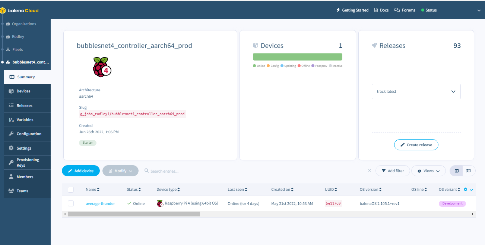
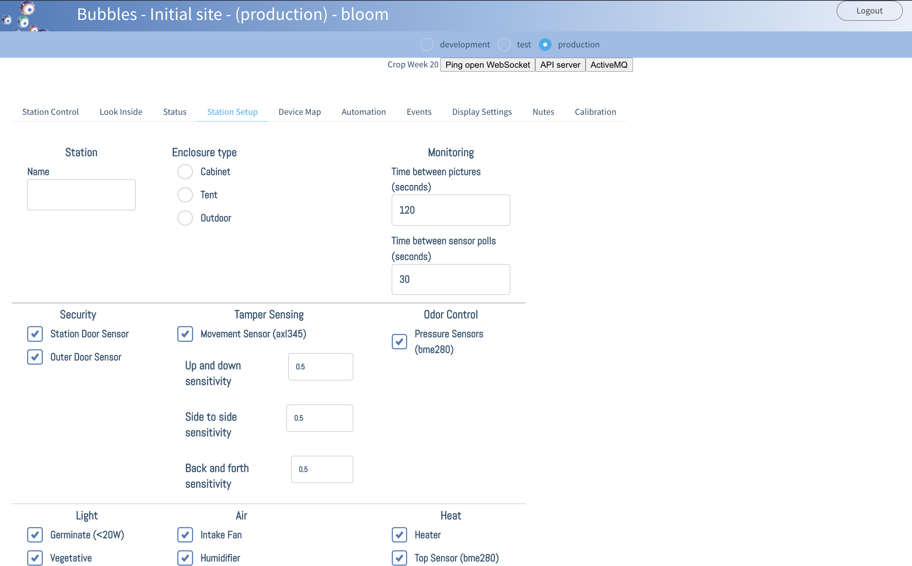
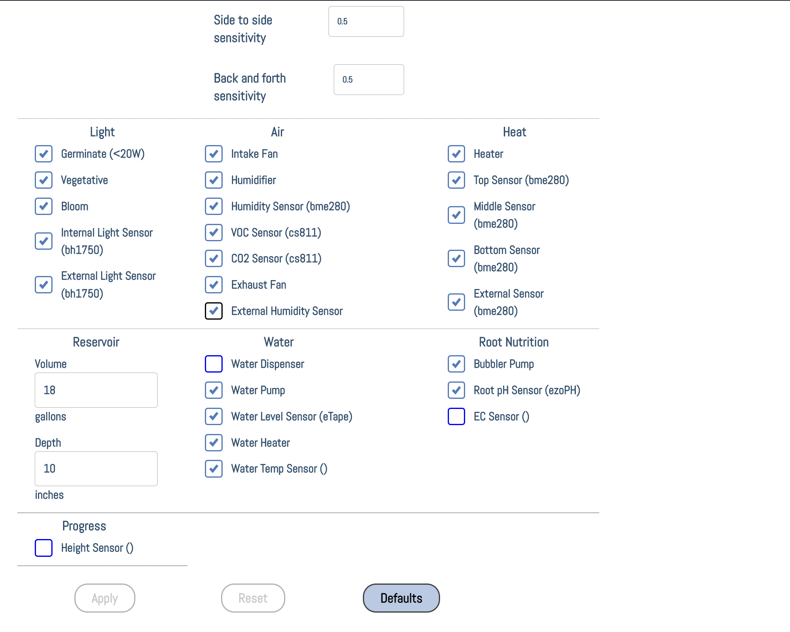
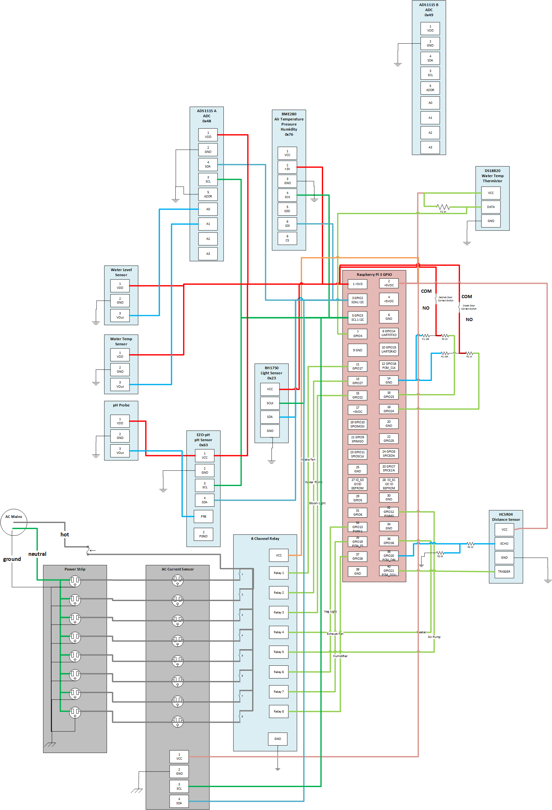

# Getting Started

Prerequisites:
* Raspberry Pi 4 8GB for the controller
* (2) Raspberry Pi 3B+ for the edge-devices
* (3) blank 32G microSD cards
* A free account at [balena.io](https://balena.io)
* A 32G USB3 flash drive

## Build the hardware

### Physical cabinet
[See the physical cabinet readme](cabinet/README.md)


## Controller device
* Plug the 32G USB3 flash drive into the USB3 port on the Raspberry Pi 4

### Setup Prerequisites
* Install git
* Install [balena CLI tools](https://www.balena.io/docs/reference/balena-cli/)
* Install Go version 1.17.5 or later
* Install Mage
* Install Balena Etcher

### Setup the controller device FIRST!

* Clone the [controller repo](https://github.com/bubblesnet/controller)
* ``` git clone https://github.com/bubblesnet/controller.git ```
* Make a fleet named "bubblesnet4_controller_aarch64_prod" on balena, with a default device of Raspberry Pi 4.  Add the
  Raspberry Pi 4 to this fleet.
* Setup the [Fleet Environment Variables](balena/EnvironmentVariables.md) for the bubblesnet4_controller_aarch64_prod fleet
* Setup the [Fleet Device Configuration](balena/DeviceConfiguration.md)
* Run the command ``` push_prod.cmd ```
* On the balena website, in the bubblesnet4_controller_aarch64_prod fleet, click add device, development, wifi and ethernet.
* This will bring up Balena Etcher and allow you to burn a balena image to one of your 32G microSD cards.
* BE VERY CAREFUL WITH BALENA ETCHER BECAUSE IT WILL ALLOW YOU TO OVERWRITE YOUR HARD DRIVES IF YOU USE IT WRONG!!!!!!!!
* Flash 2 bubblesnet3 images, one for the cabinet edge-device, one for the external device
* Plug the 32G microsd card into the cabinet Raspberry Pi 4
* Turn on the Pi
* Connect this edge device to your wifi network by connecting your dev machine to the network named "Wifi_Connect_blahblahblah"
* This edge device should now appear in your balena fleet named "bubblesnet3"
* In balena, click into the device and note the IP address
* Setup the [Edge-Device Device Variables](balena/EnvironmentVariables.md) for the bubblesnet4_controller_aarch64_prod fleet. Use DEVICED 70000008 for the cabinet device, 70000005 for the external device
* Setup the [Device Configuration](balena/DeviceConfiguration.md)



### Turn all the sensors, outlets and dispensers OFF
* Reboot the Pi 4
* When it appears in the balena dashboard, get the local IP
* In your browser, go to that local IP address
* Login with default credentials
* Go to the Station Setup tab, deselect all of the checkboxes and hit apply





* Go to the bubblesnet3 fleet and set the API_HOST, ACTIVEMQ_HOST fleet variables to that IP address.  This will allow the Pi 3B+s in the bubblesnet3 fleet to find the controller and get their own configuration.  Turning off the sensors in station setup allows you to add and test sensors one by one.

## Setup the cabinet and external edge-devices
* Login to the balena CLI tools by running ``` balena login ```
* Clone the [edge-device repo](https://github.com/bubblesnet/edge-device)
* ``` git clone https://github.com/bubblesnet/edge-device.git ```
* Make a fleet named "bubblesnet3" on balena, with a default device of Raspberry Pi 3B+.
* Setup the [Fleet Environment Variables](balena/EnvironmentVariables.md) for the bubblesnet3 fleet 
* Setup the [Fleet Device Configuration](balena/DeviceConfiguration.md)
* Run the command ``` push_prod.cmd ```
* On the balena website, in the bubblesnet3 fleet, click add device, development, wifi and ethernet.
* This will bring up Balena Etcher and allow you to burn a balena image to one of your 32G microSD cards.  
* BE VERY CAREFUL WITH BALENA ETCHER BECAUSE IT WILL ALLOW YOU TO OVERWRITE YOUR HARD DRIVES IF YOU USE IT WRONG!!!!!!!!
* Plug the 32G microsd card into the cabinet Raspberry Pi 3B+
* Turn on the Pi
* Connect this edge device to your wifi network by connecting your dev machine to the network named "Wifi_Connect_blahblahblah"
* This edge device should now appear in your balena fleet named "bubblesnet3"
* Repeat this process for the external edge-device.


### Cabinet device

The Pi that runs inside the cabinet (i.e. cabinet device) is extremely elaborate
and easy to screw up.  I strongly recommend qwiic connections wherever possible.

THIS SCHEMATIC IS OUTDATED BUT STILL INSTRUCTIVE.  THE CURRENT SENSORS DO NOT EXIST, THE RELAY IS CONNECTED TO GPIO
THROUGH 3V-5V LEVEL CONVERTERS, AND THE DISPENSERS ARE NOT REPRESENTED. I WILL UPDATE ASAP.


#### Camera
* Pi Camera to camera port

#### QWIIC bus i2c sensors that can be chained
* BME280 temp/humidity/pressure sensor
* BH1750 light sensor
* ADXL345 accelerometer
* CCS811 CO2/VOC sensor

#### One-wire sensors
* Connect the DS18B20 water temperature one-wire sensor to the Raspberry Pi 3B+ one-wire port

#### GPIO devices
* ADS1115 analog to digital converter. Raspberry Pi 5V to the module, analog input pins to water-level, i2c to i2c bus
* GPIO pins to 3-to-5 volt level converter for AC device control
* Sainsmart 8 channel relay to level converter for AC device control
* Dispenser single-channel relays to GPIO pins and external power

### External device

The external device is pretty simple as it needs only 2 i2c modules connected.

#### QWIIC bus i2c sensors that can be chained
* BME280 temp/humidity/pressure sensor
* BH1750 light sensor


## Test the installation
* Turn automation on/off
* Turn all switches on/off
* Take a picture
* Smoke test the sensors
