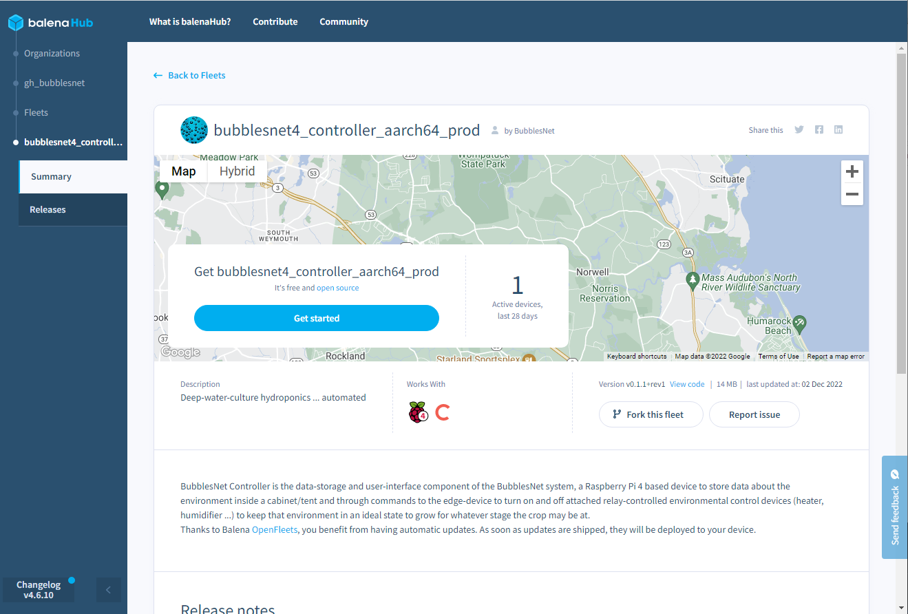
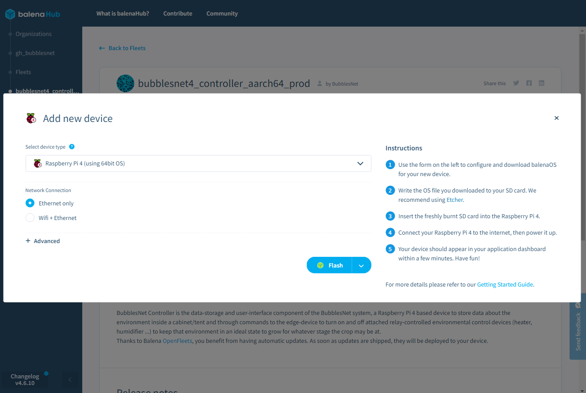
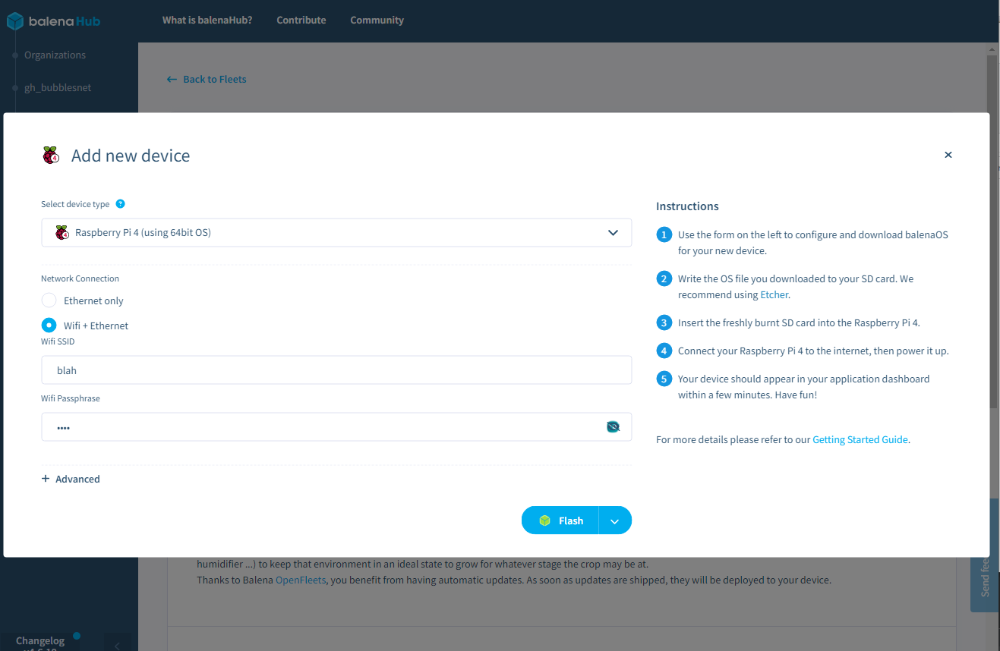
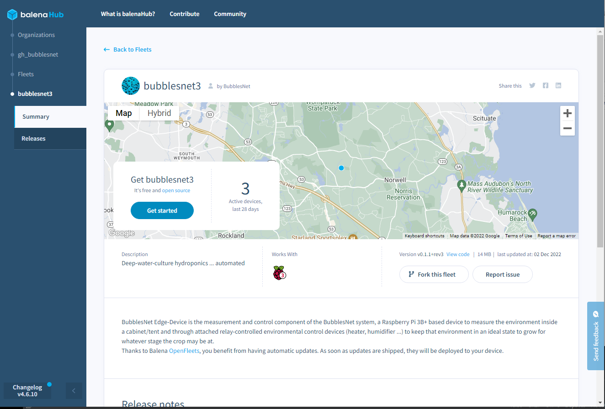
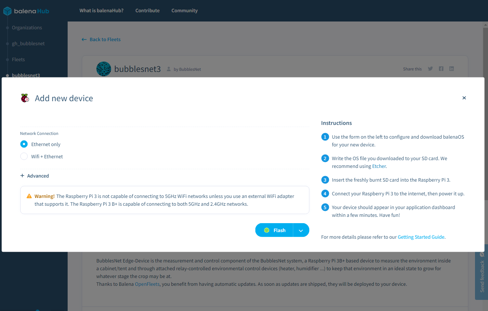
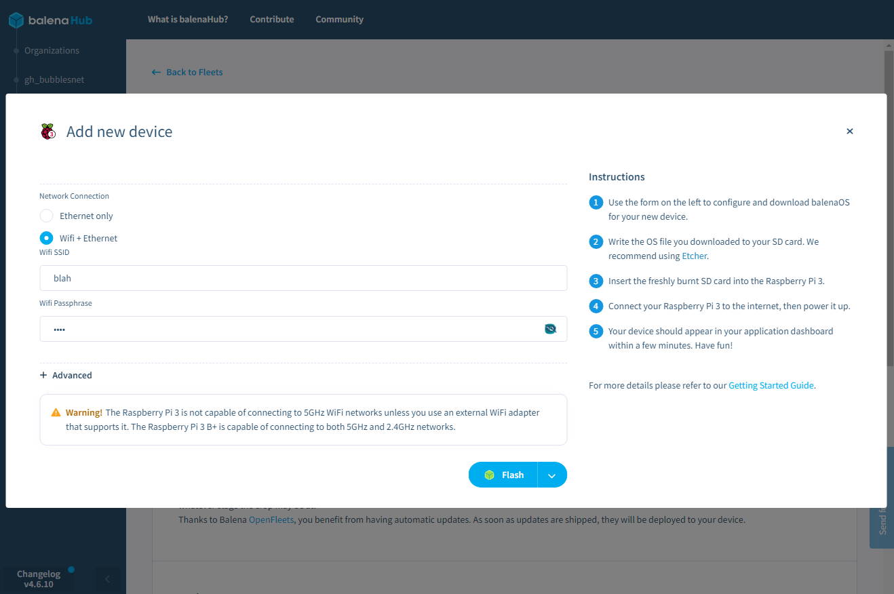

# Getting started using the Balena public fleet

BubblesNet runs two public fleets - groups of devices that run the BubblesNet code. These are the 
[edge-device fleet](https://hub.balena.io/organizations/gh_bubblesnet/fleets/bubblesnet3) 
and the [controller fleet](https://hub.balena.io/organizations/gh_bubblesnet/fleets/bubblesnet4_controller_aarch64_prod). 
In order to run an instance of BubblesNet on the public fleets you will need to have one-and-only-one device in the
controller fleet, and one or two devices in the edge-device fleet.

# Balena Etcher

Install Balena Etcher from [here](https://www.balena.io/etcher/).

# Controller

Click on "Get started":

If you're going to connect your device to Wifi, select ethernet+wifi and enter the SSID
and password:

Click on "Flash".  This will start up Balena Etcher.  Select the correct target device
(and be careful about it) and flash the device.

# Edge Device(s)

Click on "Get started":

If you're going to connect your device to Wifi, select ethernet+wifi and enter the SSID
and password:

Click on "Flash".  This will start up Balena Etcher.  Select the correct target device
(and be careful about it) and flash the device.

