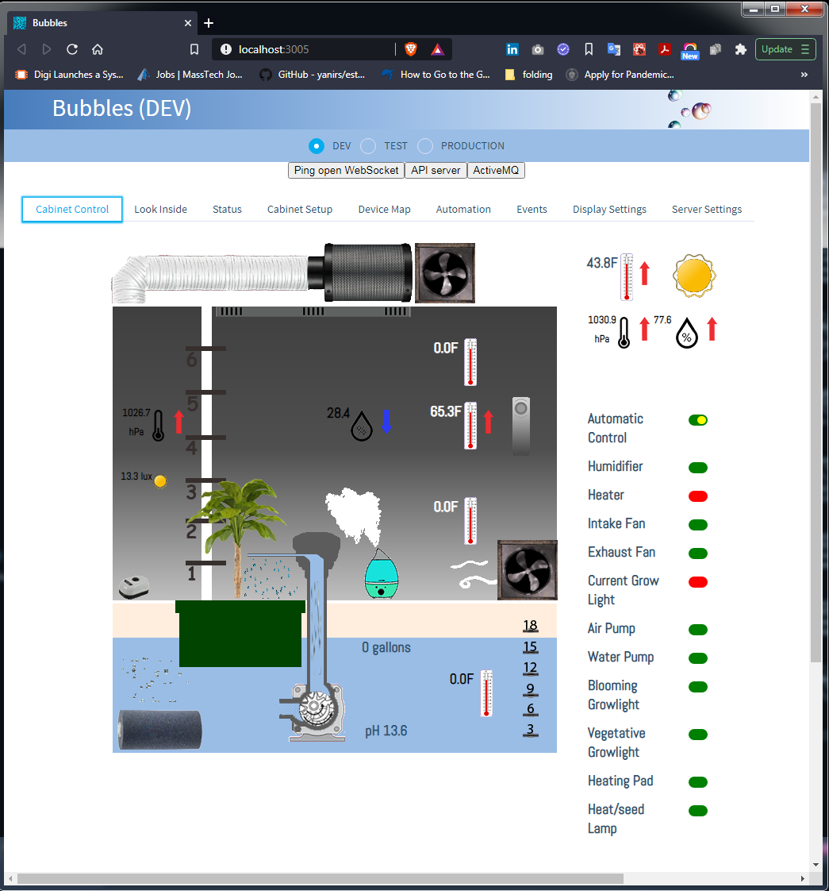

# BubblesNet
BubblesNet is a system for the monitoring and automatic control of a secure, indoor hydroponic 
setup using either a hard cabinet or a tent.  It has features that are unique to marijuana growth 
(i.e. door security, odor control) but is mostly applicable to any plant that you want to grow under
tightly controlled and monitored conditions.

## Functional Requirements
  * Provide automated environmental control of an enclosed hydroponics setup
  * Provide notification of out-of-range events
  * Provide near-realtime vision of the crop
  * Generate a stream of environmental time-series data that can be correlated post-harvest with plant growth
  * Automate as much of the entire seed to harvest pipeline as possible
  * Odor control
  * All controllable components (light, heat ...) can be manually controlled from the user interface

## Non-functional Requirements
* As little physical intervention as possible
* Once collected, data is never lost
* Standard-of-care authentication
* Encryption in flight and at rest
* Graceful degradation - no component in the chain should crash/blow-up just because another component
has failed or bogged down.

## Components
The system software has 2 components:
* Controller - contains the data storage, web user interface and alerting functions. designed to run on a desktop
  but probably runs fine on a Pi.
* Edge-device - contains the actual sensors and relay controls to monitor and control the environment in the
grow space.  designed to run on a Pi (3CMM, 3B, 3B+, 4), port to another type of device would be painful.
  
## Extensibility
The components of the system are behind APIs that should allow users to add
on to an installation of Bubbles.

Examples:

A user could add a new container to the edge-device that
simply sends properly formatted gRPC messages to the store-and-forward container
and they will end up in the database and accessible as events in the UI.

A user could send properly formatted messages to the Edge/Server API that
would end up in the database and UI.

## Pre-requisites
* Postgres 
* ActiveMQ
* Balena (IoT fleet maintenance service)

### Controller
The controller is a control, and data collection and analysis service designed to 
work with the bubblesnet edge-device.  It consists of:

Client - a web user interface for controlling one or more edge devices
and viewing the data from those devices.  Written in React.

Server - an API server that serves both the controller React application AND 
the edge devices manipulating the physical environment and queueing data for storage.  Written
mostly in NodeJS.

The Server contains three distinct nodejs express applications:
* API server - takes measurement and event messages from edge-devices and queues them for processing.  Also
  serves UI data requests. 
* Queue server - takes measurement and event messages off the queue and stores them in the database and also publishes
those messages to a "topic" (queue) for the web socket server to consume.
* WebSocket server - pushes messages from the "topic" out to any Client instance (UI) that has connected to it. This
is what gives the user interface its ability to show environment changes in real-time.
  
### Edge-device
The edge device is one or more Raspberry Pi devices running BalenaOS (Yocto). The device runs at least
4 containers:
* sense-go - sensor code written in Go along with relay control, sends all measurement to store-and-forward container via gRPC
* sense-python - sensor code written in Python3, sends all measurement to store-and-forward container via gRPC
* store-and-forward - stores messages from the sensor containers until it can forward them via the Edge-Server API
* wifi-connect - a service to let you connect the device to the correct wifi network

## Links to deeper dives
* [Messaging](Messaging.md)
* [Data Structures](DataStructures.md)
* [API: GRPC](APIGRPC.md)
* [API: Edge/Server](APIEdge.md)
* [API: UI Service](APIUIService.md)

## History (i.e. where the bugs come from)
This open-source project is a port and integration of an existing set of unrelated personal projects.  This
original set of projects included:
* Server written in Java J2EE as APIs that write JSON files to filesystem
* File processors written in Java that read/write ActiveMQ, move file data into databases and archive files
* A MySQL database
* An Android/Android Things edge device that itself was a rewrite of a RPi python edge device

