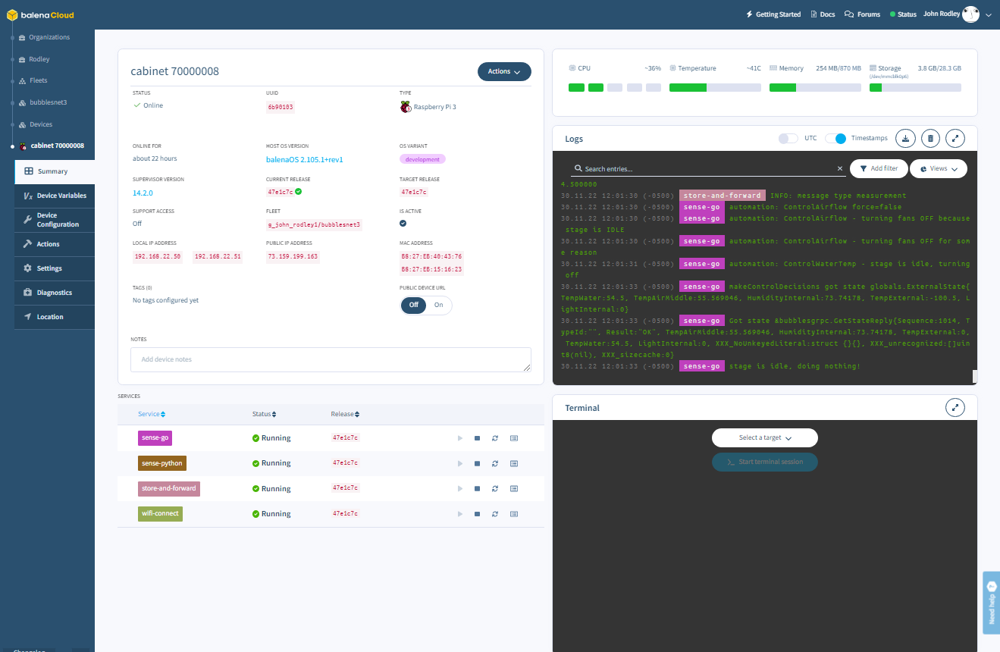

# BubblesNet
BubblesNet is a system for the monitoring and automatic control of a secure, indoor deep-water-culture hydroponic 
setup using either a hard cabinet or a tent.  It has some unique features 
(i.e. door security, odor control) but is mostly applicable to any plant that you want to grow under
tightly controlled and monitored conditions.

If you're sure you know what you're doing, and you're in a super-duper hurry to install 
and run an instance of BubblesNet, [start here](GettingStarted.md)

You're here, so you probably already have an idea what requirements you're 
looking to fulfill, but to see what was top of my mind developing this, see
[the requirements list.](Requirements.md)

**This repository contains only the documentation** for bubblesnet, no code.  
The actual code for this system resides in 2 other repos:
- https://github.com/bubblesnet/edge-device
- https://github.com/bubblesnet/controller

I structured the repositories this way because of the very distinct nature of the edge-device and controller
and more importantly because of the significant documentation required by the 
physical components of the system.  I may live to regret this.

## The Dream
The most ambitious aspiration for this project is to use data science/ML to correlate the 
substantial data collection with the results seen in the pictures collected.  

## The cabinet

Here's a picture of the cabinet - a wood box.  

The reservoir sits in the bottom of the cabinet, grow light in the top, all sorts
of stuff mounted in various places on the cabinet ....

For detail on the cabinet [click here](cabinet/README.md)

Here is what the user interface of the system looks like in operation:

The Station Control screen is where I spend 99% of my time in the system.

### Devices
The system software has 3 devices:
* [Controller](https://github.com/bubblesnet/controller) - A Raspberry Pi 4 8GB that contains the data storage, web user interface and alerting functions. 
* [Edge-device](https://github.com/bubblesnet/edge-device) (cabinet) - A Raspberry Pi 3B+ that contains the actual sensors and relay controls to monitor and control the environment in the
grow space.  Designed to run on a Pi (3CMM, 3B, 3B+, 4), port to another type of device would be painful.
* Edge-device (external) - A Raspberry Pi 3B+ that contains the sensors to monitor the environment outside the cabinet.

Within the system these devices are typically referred to as "edge_device".

### Controller
The controller is a single Raspberry Pi 4 running the control user interface, and data collection and analysis services designed to 
work with the bubblesnet edge-device. The controller user interface can be accessed from a browser on any device
on the same network.

The controller uses seven containers (which balena calls micro-services), 1 user interface, 2 with prepackaged balena blocks
 for database and queue and 3 containers with custom nodejs express applications:
* **ui** - a web user interface for controlling one or more edge devices
  and viewing the data from those devices.  Written in React.
* **database** Postgresql XX.X database container
* **activemq** ActiveMQ XX.X queue system container
* **api** API server - takes measurement and event messages from edge-devices and queues them for processing.  Also
  serves UI data requests. 
* **queue** Queue server - takes measurement and event messages off the queue and stores them in the database and also publishes
those messages to a "topic" (queue) for the web socket server to consume.
* **websocket** WebSocket server - pushes messages from the "topic" out to any Client instance (UI) that has connected to it. This
is what gives the user interface its ability to show environment changes in real-time.
* **wifi-connect**  - a pre-cooked balena utility which runs an access point that allows you to connect this device to your wifi.

### Edge-device
The edge device is one or more Raspberry Pi devices running BalenaOS (Yocto). The device runs at least
4 containers:
* **sense-go** - sensor code written in Go along with relay control, sends all measurement to store-and-forward container via gRPC
* **sense-python** - sensor code written in Python3, sends all measurement to store-and-forward container via gRPC
* **store-and-forward** - stores messages from the sensor containers until it can forward them via the Edge-Server API
* **wifi-connect** - a service to let you connect the device to the correct wifi network

## Links to deeper dives
* [Detailed Notes](Notes.md)
* [Messaging](Messaging.md)
* [Database](Database.md)
* [Data Structures](DataStructures.md)
* [API: GRPC](APIGRPC.md)
* [API: Edge/Server](APIEdge.md)
* [API: UI Service](APIUIService.md)
* [History](History.md)

