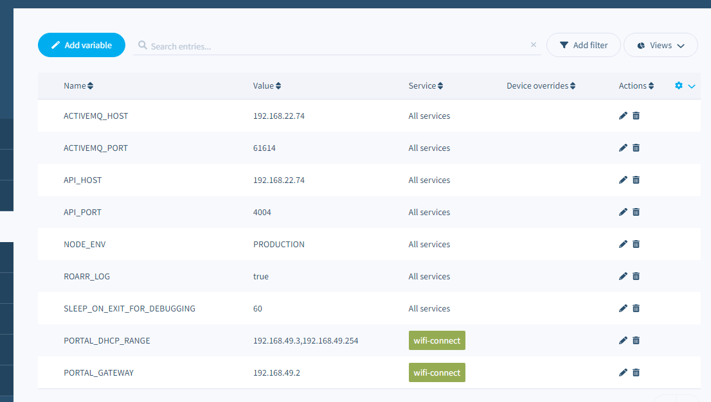
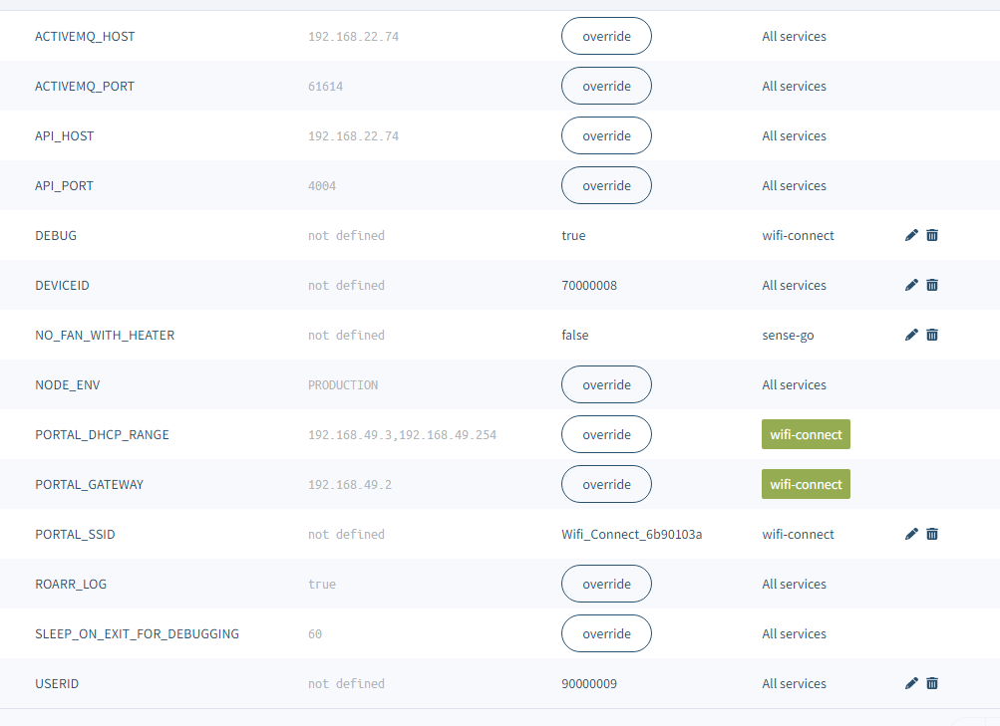
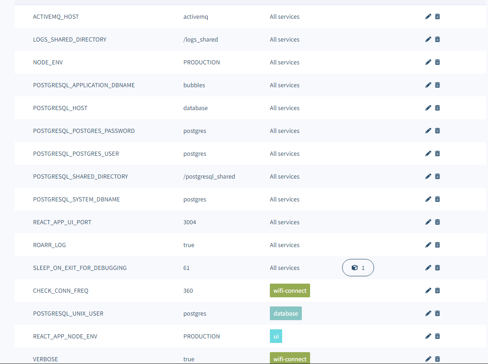
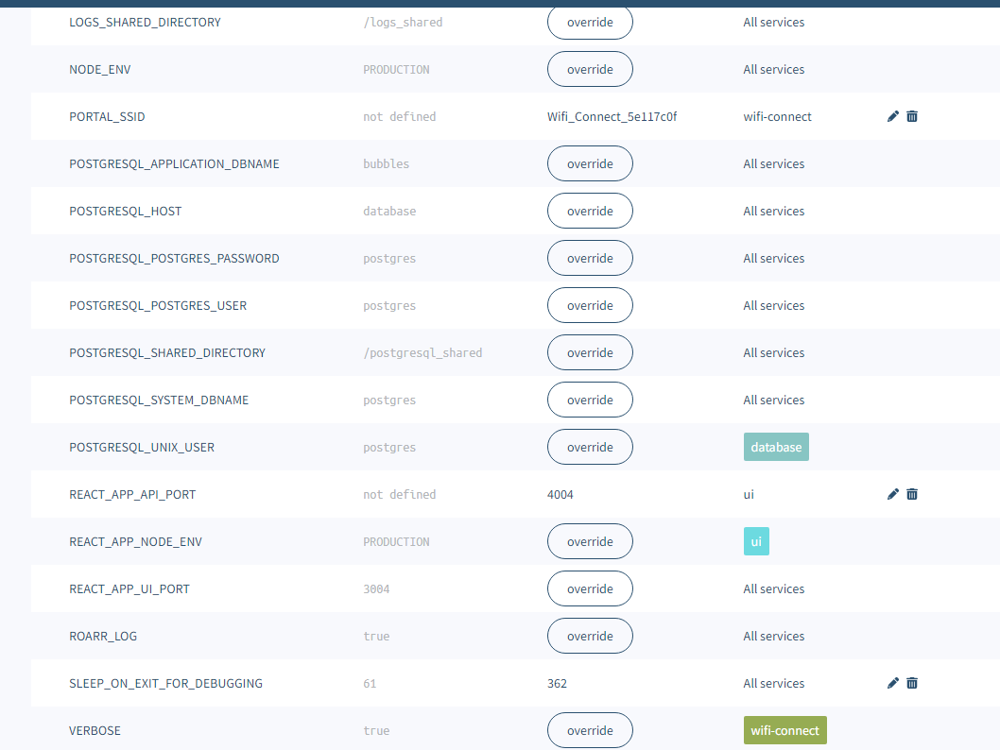

# Environment Variables

## Edge Device Fleet Variables

* ACTIVEMQ_HOST - the IP address of the controller device
* ACTIVEMQ_PORT - the port that ActiveMQ is listening on (61614)
* API_HOST - the IP address of the controller device
* API_PORT - the port that the controller API is listening on (4004)
* NODE_ENV - PRODUCTION
* ROARR_LOG - true
* SLEEP_ON_EXIT_FOR_DEBUGGING - seconds that a container that has errored out will sleep before exiting, useful for debugging (60)
* PORTAL_DHCP_RANGE 192.168.49.3,192.168.49.254 - IP address range for the wifi-connect container to use
* PORTAL_GATEWAY 192.168.49.2 - IP address that the wifi-connect container will use for itself

## Edge Device Device Variables 
* DEBUG - true
* DEVICEID - (70000008)
* NO_FAN_WITH_HEATER - (false)
* PORTAL_SSID - the publicly visible SSID of the wifi connect container to be used when connecting the device to wifi.  (Wifi_Connect_<first 8 of balena device uuid)
* USERID - (90000009)

## Controller Fleet Variables

* ACTIVEMQ_HOST - container name of the ActiveMQ host (activemq)
* CHECK_CONN_FREQ - number of seconds between connection check on wifi-connect container
* LOGS_SHARED_DIRECTORY - the name of the directory shared between containers for storing old logs (must be /logs_shared)
* NODE_ENV - controls which ports are user for services (must be PRODUCTION)
* POSTGRESQL_APPLICATION_DBNAME
* POSTGRESQL_HOST
* POSTGRESQL_POSTGRES_PASSWORD
* POSTGRESQL_POSTGRES_USER
* POSTGRESQL_SHARED_DIRECTORY
* POSTGRESQL_SYSTEM_DBNAME
* POSTGRESQL_UNIX_USER
* REACT_APP_NODE_ENV (must be PRODUCTION)
* REACT_APP_UI_PORT - (must be 3004)
* ROARR_LOG - true
* SLEEP_ON_EXIT_FOR_DEBUGGING - seconds that a container that has errored out will sleep before exiting, useful for debugging (60)
* VERBOSE - debugging level (true)

## Controller Device Variables
* DEBUG - set to '' for no output, * for silly levels of output.  Set per container.
* PORTAL_SSID - the publicly visible SSID of the wifi connect container to be used when connecting the device to wifi.  (Wifi_Connect_<first 8 of balena device uuid)
* REACT_APP_API_PORT - (must be 4004)

