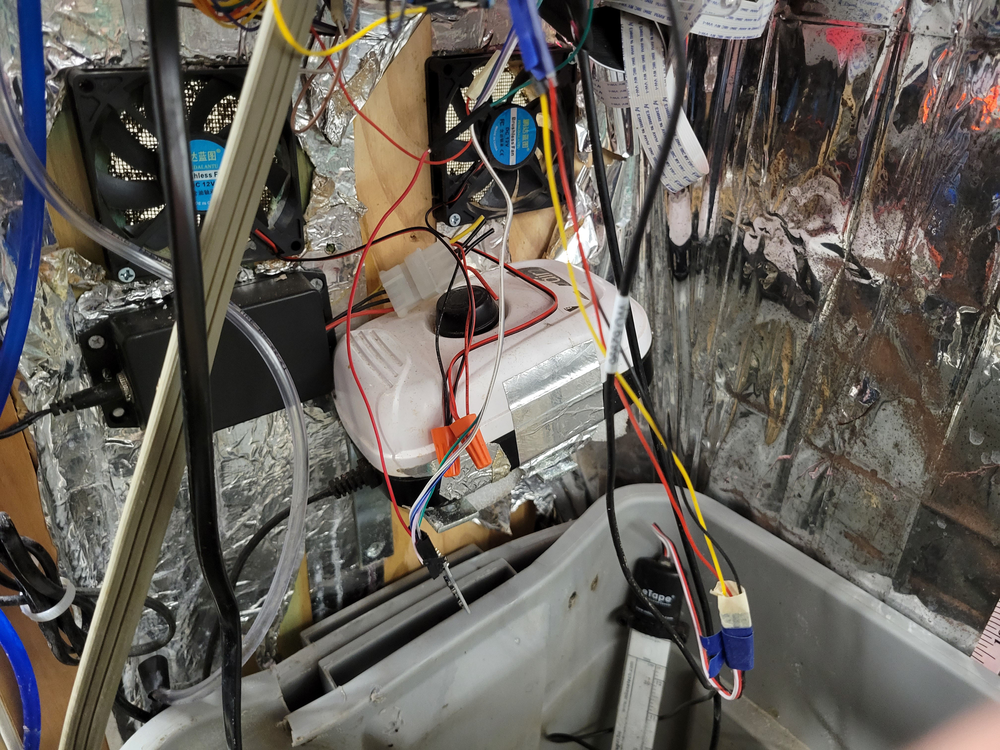
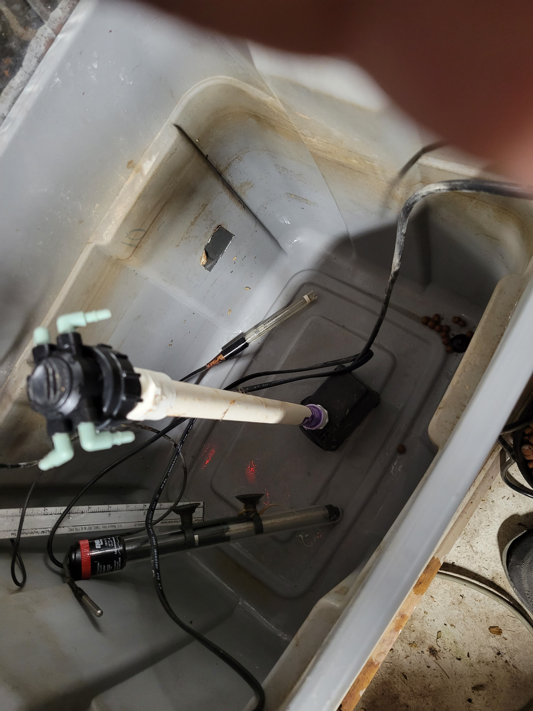
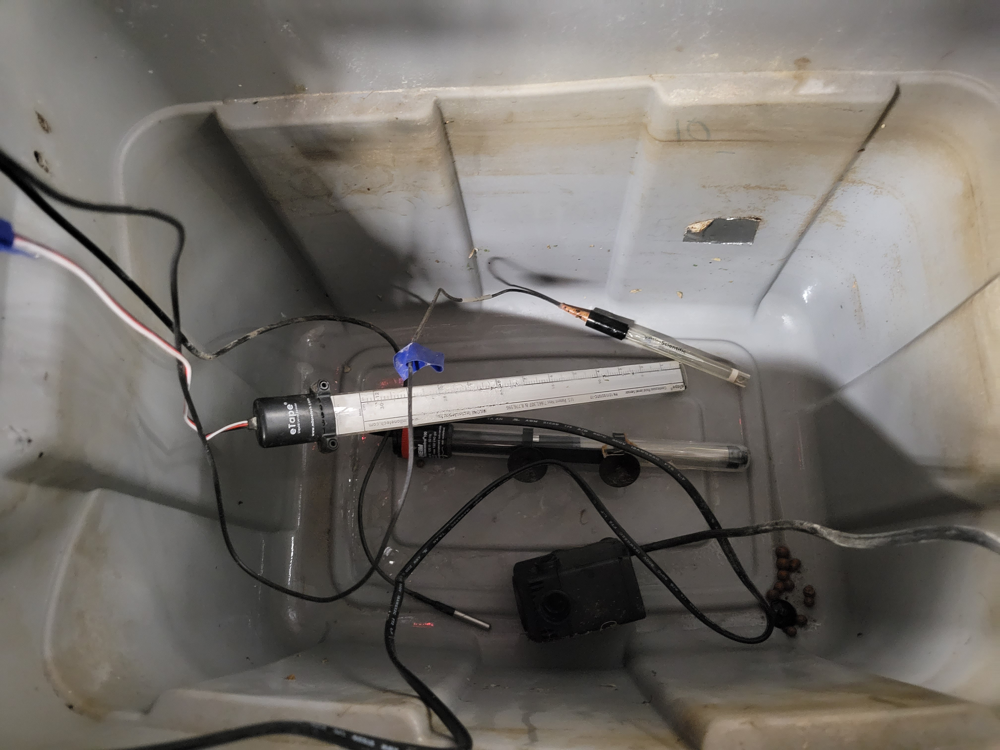
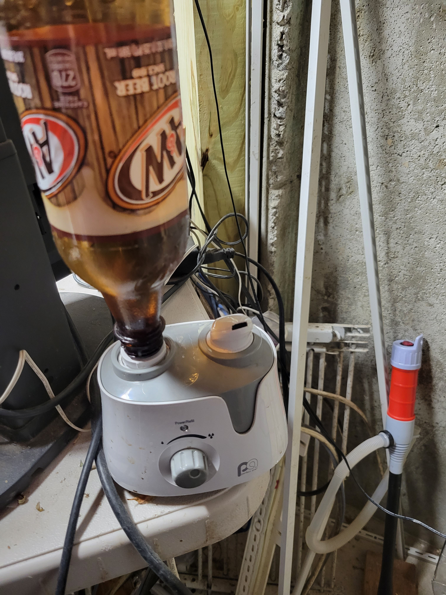
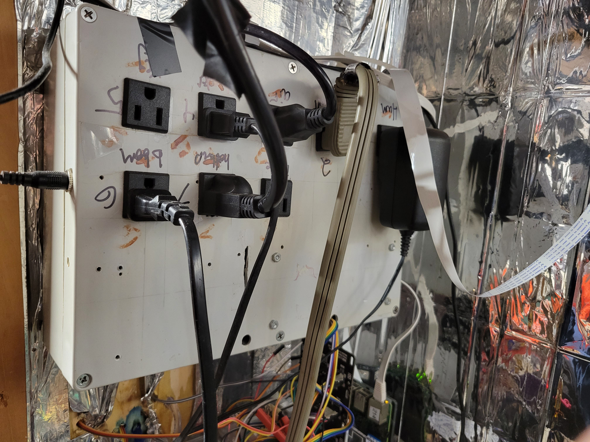
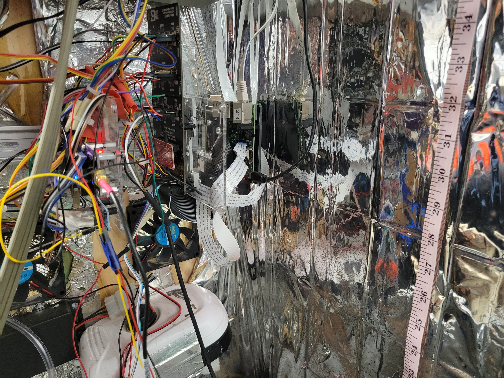
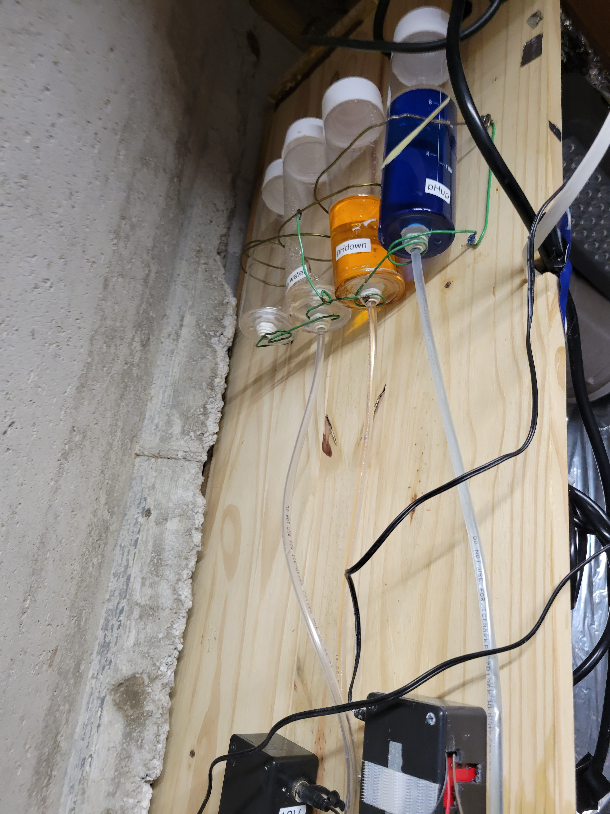
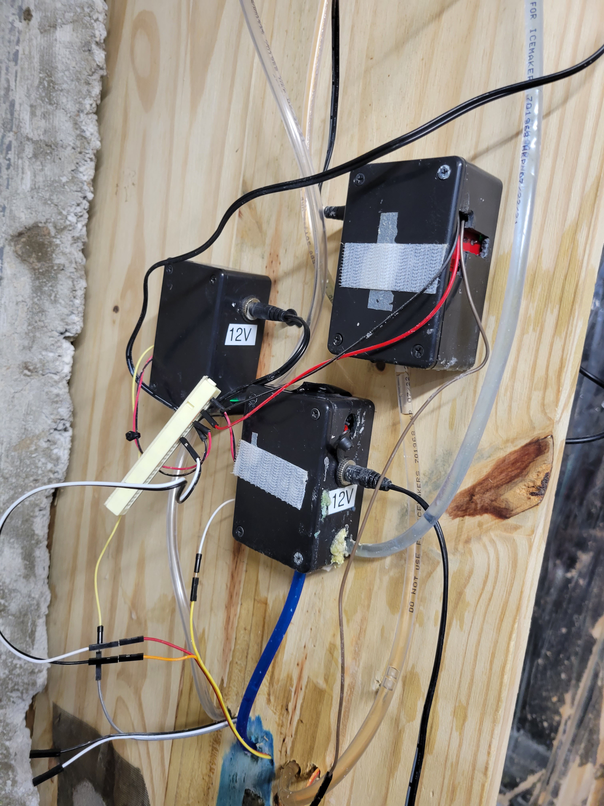

# The Cabinet

The design of the cabinet was driven by the following requirements:
* Fit in a standard American sized home closet
* Physical security
* Strict odor control
* Reservoir of 10-20 gallons to support 2-4 week time between water changes
* Plants up to 5' tall

The cabinet is 72" tall, by 36" wide by 24" deep. The top, bottom and both sides are 3/4" pine, the back is 1/4" plywood.
All internal surfaces are covered with reflective blanket to provide maximum light to the plants.

The cabinet is air and water tight except for the intake and exhaust fans. Air only leaves the cabinet through 
the exhaust fan. The exhaust fan is mounted externally on top of the cabinet and draws air from inside via the carbon
filter through a standard 4" dryer pipe.

The deep-water-culture reservoir is a doubled-up 20 gallon plastic storage container with lid.  The lid has four holes 
in it to hold four net-pots filled with hydroton to grow the plants in.  There's also a hole in the center for a 1/4"
PVC pipe to feed water from the water pump to the drip manifold that continuously waters the plants.

The powered devices inside the reservoir - water pump, water heater - are powered through AC cords fed through slits
just beneath the lid.  The sensors in the reservoir - water temp, water level, pH - are threaded through the net-pots.

The humidifier and heater were placed on the reservoir lid mostly and that was never satisfactory.  
[See notes for discussion.](../Notes.md)

The camera is mounted in a fixed location on the back of the inside of the cabinet about level with the grow light.
[See notes for discussion.](../Notes.md)

Power to the powered devices (air pump, water pump, intake and exhaust fans, water heater, heater, humidifier, grow light) are 
provided by a custom-built controllable power strip.  The power strip is mounted in a plastic case mounted halfway
up the left side of the inside of the cabinet.

The electronics for the cabinet (Pi, sensors ...) are mounted on a DIN rail beneath the controllable power strip.  

The dispensers for the nutrients (phUp, phDown ...) are mounted high up, externally on the left side of the cabinet.

The dispenser valves are mounted externally just underneath the dispenser bottles about level with the internal DIN rail. When 
a valve is open, nutes are gravity fed from the dispenser bottles through a 1/8" tubing to the valve, and thence via 
more 1/8" tubing through the side of the cabinet and then through the lid of the reservoir.

The external Pi that tracks external pressure, temperature, humidity, and light is in a standard Pi case placed (not mounted)
on top of the cabinet.