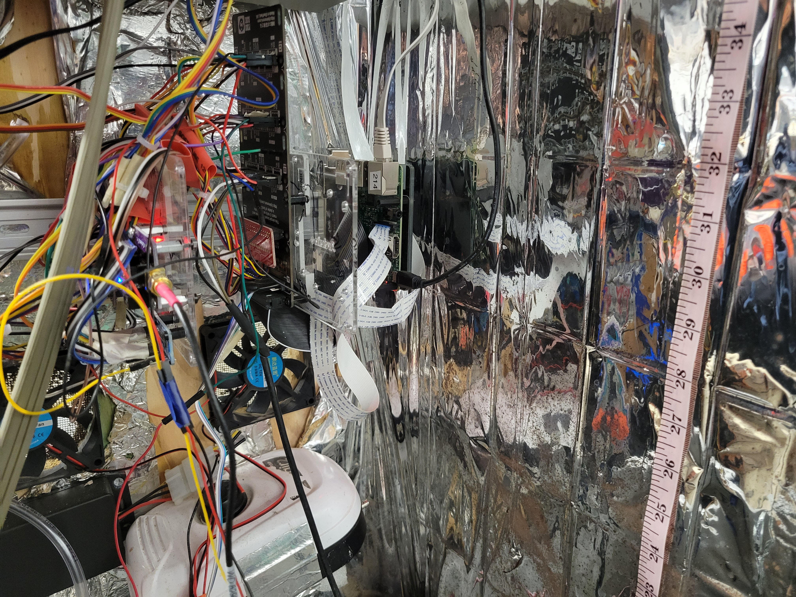

# The Electronics

## List of hardware modules

* [ADS1115 A to D converter (2)](datasheets/ads1115.pdf)
* [BME280 temperature/humidity/pressure sensor (4 top, middle, bottom and external)](datasheets/bst-bme280-ds002.pdf)
* BMP280 temperature/pressure sensor (as substitute for BME280)
* [ADXL345 accelerometer for tamper detection](datasheets/ADXL345.pdf)
* Pi Camera
* 8-port relay
* Single port relay (1 for each dispenser)
* X Volt Valve (1 for each dispenser)
* [CCS811 CO2/VOC sensor](datasheets/CCS811_Datasheet-DS000459.pdf)
* [DS18B20 analog water temperature sensor](datasheets/DS18B20.pdf)
* [ezoPH pH sensor](datasheets/pH_EZO_Datasheet.pdf)
* ezoPH pH sensor carrier board
* ezoPH pH sensor probe
* [eTape water lever sensor](datasheets/Standard eTape Data Sheet.pdf)
  
Within the system, these modules are generally referred to as "module".  
Datasheets for these modules are in the [datasheets directory](datasheets).

## Wiring up the cabinet and external edge-devices
The following schematic describes the cabinet edge-device.  The external edge-device is identical
except that it only contains the bme280 and bh1750 modules.

THIS SCHEMATIC IS OUTDATED BUT STILL INSTRUCTIVE.  THE CURRENT SENSORS DO NOT EXIST, THE RELAY IS CONNECTED TO GPIO
THROUGH 3V-5V LEVEL CONVERTERS, AND THE DISPENSERS ARE NOT REPRESENTED. I WILL UPDATE ASAP.

The cabinet device is mounted on a DIN rail, with the sensors, level converters and ADCs mounted
on adjacent DIN plates.  The wiring I used was almost all either qwiic (preferred) or less-ideally
2.54mm pitch jumpers.

This, obviously is less-than-ideal.  See [Notes](../Notes.md) for discussion.

