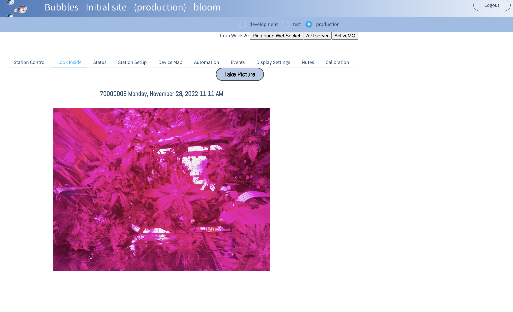
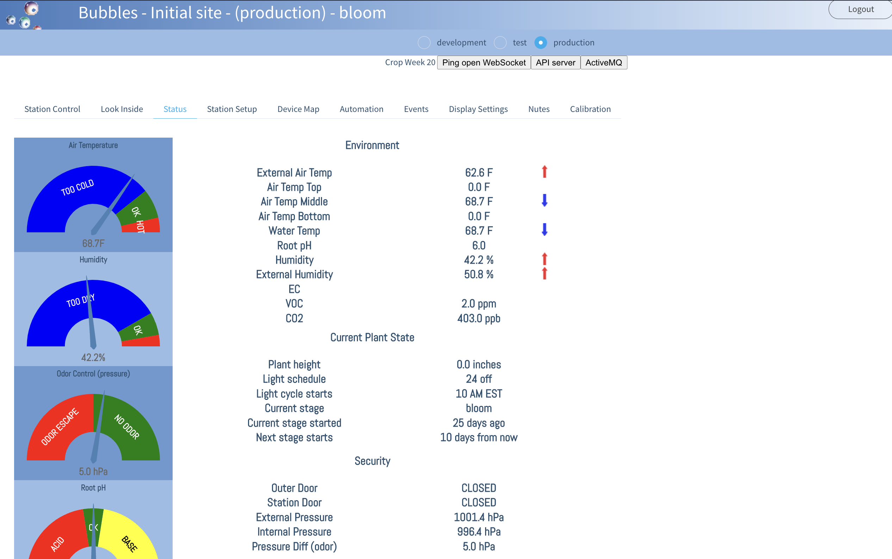
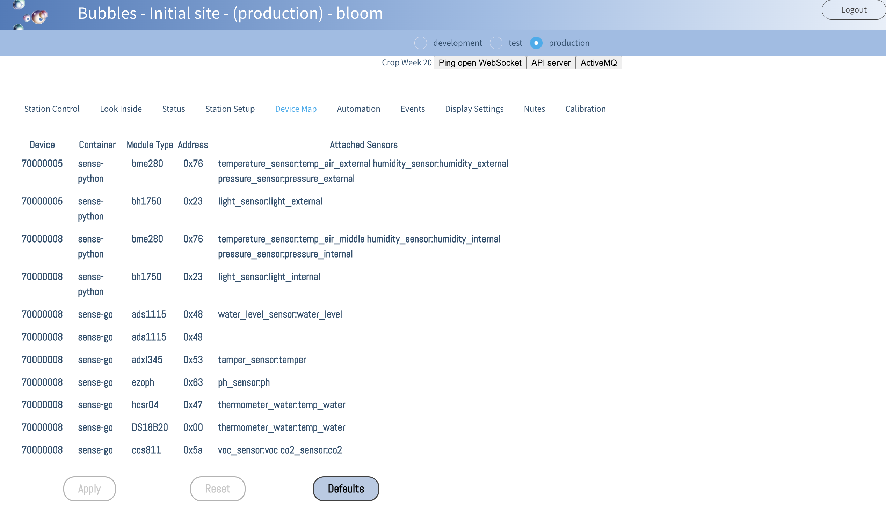
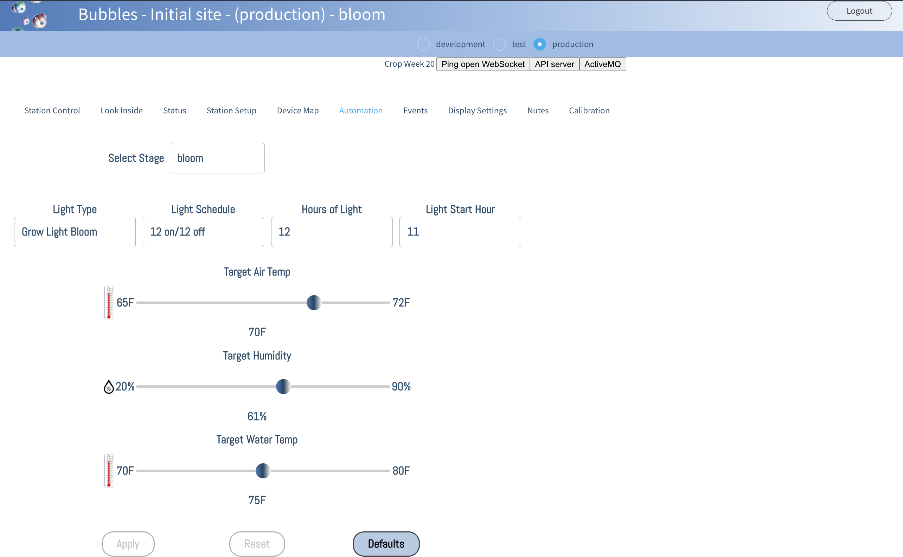
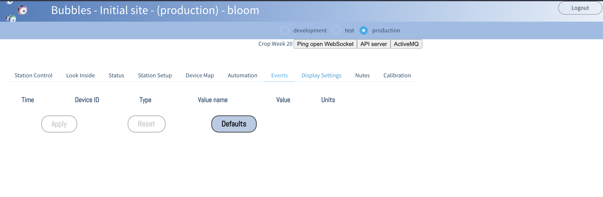
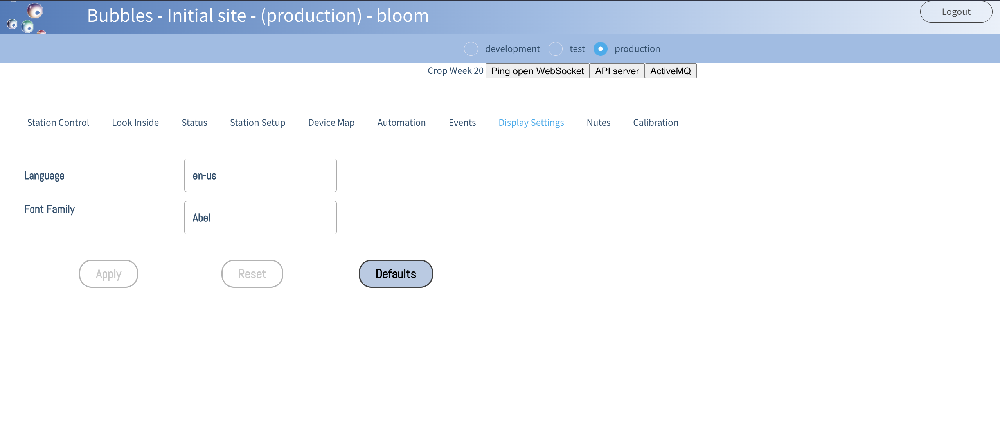
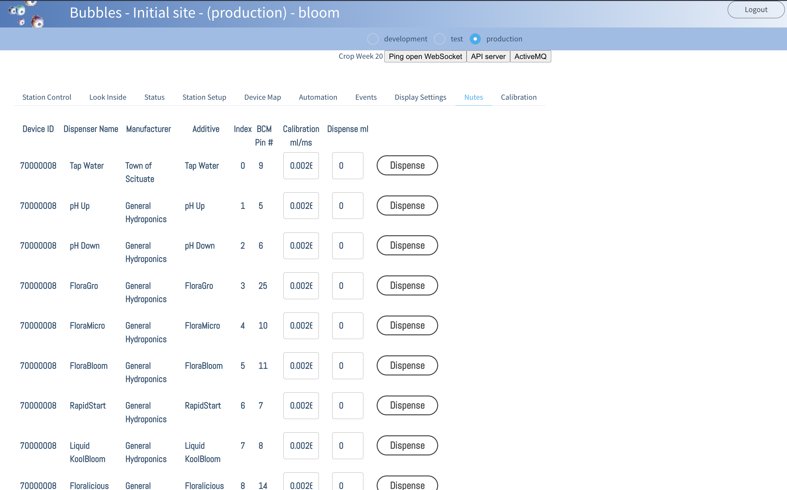
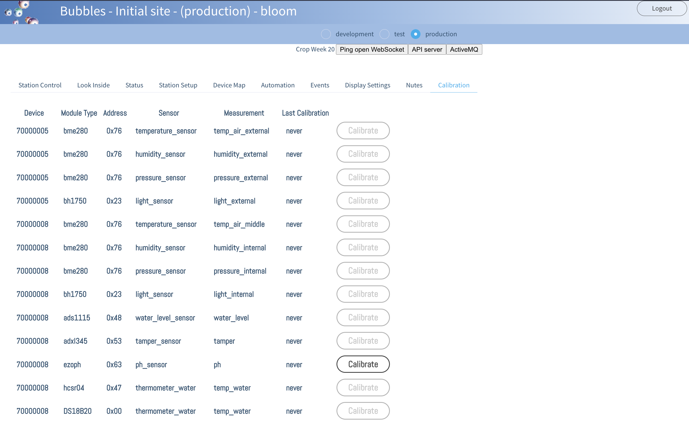

# BubblesNet User Interface
The system is designed to be run as much as possible from within the UI.  

## Login

## Station Control

## Look Inside

## Status

## Setup

## Device Map

## Automation

## Events

## Display Settings

# Nutes

## Calibration

